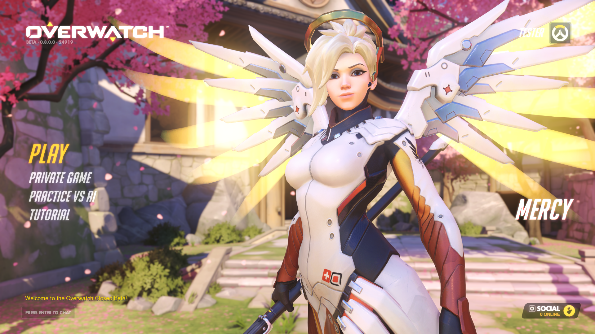
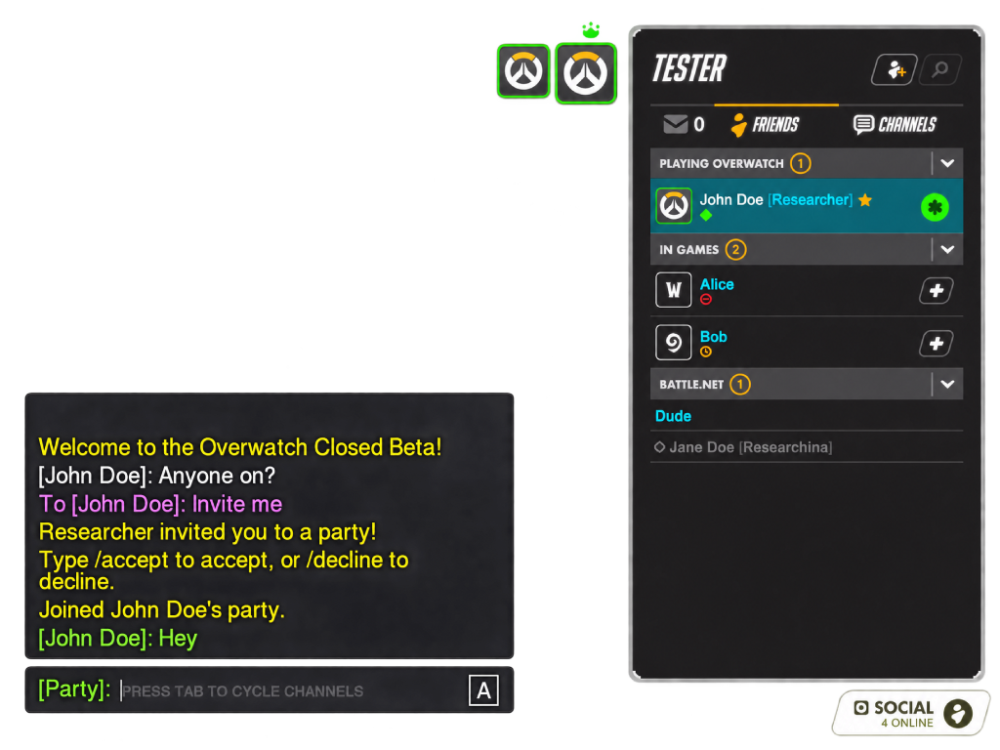

# Overwatch 0.8 lobby showcase

A small, modular server that brings the original **Overwatch Closed Beta 0.8.0.24919** client into its native lobby. Explore the original menu and social features together, or use the documented protocol research for emulator development.

This showcase builds on public Overwatch preservation research and shares its findings to support other preservation efforts.



## Features and scope

- Original hero models, default skins, idle animations and native hero names.
- Local accounts with password login and saved account/social data.
- General chat, member lists, friends, favorites, presence and direct tells.
- Party invitations, joining/leaving, kicking, leader transfer and group chat.
- Saved portraits, hero levels, optional Real ID display labels and online/away/busy status.
- Administrative dot commands and synthetic players for trying social features.
- Baseline `.game` presence for Hearthstone, WoW, StarCraft II, Diablo III, Heroes of the Storm and Battle.net only.
- Local, LAN and automatic public tunnel connections, with optional packet captures.



Matches, gameplay, XP earning and rewards are unimplemented. Play and Private
Game open the client's searching view. Block and Report packets are logged
without processing those actions. The runtime supports one beta executable;
cross-PC compatibility is not fully verified.

## Setup and use

Use **Windows x64 and 64-bit Python 3.11 or newer**, with pip. Place the
complete showcase folder inside the beta client folder:

```text
Overwatch-0.8/
  GameClientApp.exe
  ... original client files and assets ...
  overwatch-0.8-lobby-showcase/
    Start-Server.bat
    Start-Client.bat
    README.md
    launch.py
    ow08/
    virtual/
    misc/
    research-docs/
      images/
```

First launch creates `.venv` and installs `cryptography>=42`, requiring internet
access. `.\Start-Client.bat --setup-only` prepares the environment without
launching. `--python "C:\path\python.exe"` selects an interpreter and must be
the first option.

1. Open `Start-Server.bat`, choose This PC, LAN, or Virtual LAN/VPN, then
   answer the extended-mode prompt. Wait for **Server ready** and keep this
   window open.
2. In the separate server command window, create an account for each player:
   `.accountcreate PlayerName ChooseYourPassword`. The response includes their
   BattleTag and native login alias. Give them the printed login
   alias and their password privately. These are local project accounts;
   the email-shaped aliases do not contact email services or Battle.net.
3. Open `Start-Client.bat`. Press Enter to use the game folder one level above
   `overwatch-0.8-lobby-showcase`, or supply another folder or `GameClientApp.exe` path. Select the
   connection and enter `127.0.0.1` for this PC, the host's IPv4 for LAN, or the
   latest public identifier for a virtual connection.
4. Log in with the exact project alias and password. Keep the client launcher
   open for the entire session.

LAN uses the host's IPv4 and inbound TCP **47325**. Virtual LAN/VPN uses a
temporary localhost.run HTTPS identifier and requires internet access on every
PC plus Windows OpenSSH Client on the host. Guests and the host's own client
use that identifier. Anyone with it can reach the gateway; its availability
and lifetime are controlled by the tunnel provider.

```powershell
.\Start-Server.bat --network local
.\Start-Client.bat --network local --game .. --server-ip 127.0.0.1

.\Start-Server.bat --network lan --server-ip 192.168.1.10
.\Start-Client.bat --network local --game .. --server-ip 192.168.1.10

.\Start-Server.bat --network virtual
.\Start-Client.bat --network virtual --game .. --server-ip https://example.lhr.life
```

Use the host's printed address. `--help` lists options; `--remote-port` changes
the gateway port on both launchers. `--no-prompt` selects default mode. The
[interactive guide](misc/HowToUse.txt) covers connection checks and troubleshooting.

## Extended mode and commands

Default mode enables 18 heroes at level 1. Extended mode adds D.Va, Genji and
Mei and saved levels through `.herolevel <account> <hero/all> <level>` (1..20).
Level updates refresh the account's catalog. Skins are unsupported;
the [menu notes](research-docs/MENU_INITIALIZATION.md#skin-wrappers-and-recoloring)
describe the failed raw-theme approach and unresolved selector behavior.

The lobby hero follows the original client's selection: it picks randomly
among progressed heroes when available and caches that choice. The server
supplies the account's catalog and levels. See
[native hero selection](research-docs/MENU_INITIALIZATION.md#native-featured-hero-selection).

Use `.help` in the server command window for account, friend, party, portrait,
presence and messaging commands. `.serverip` (or `.ip`) prints the current
joining address, including the LAN gateway port or latest public tunnel identifier.
`.login PlayerName` creates a synthetic player
on a real account; `.logoff PlayerName` releases it. 
Console actions may target both synthetic and real players.

`.game PlayerName None` shows an online synthetic friend on Battle.net without
playing a game. Game names ignore case; `.game` lists the choices. Selection
resets on a new login.

`.favorite <user> <friend> <on|off>` (alias: `.favoriteuser`) saves a friend's
favorite status for the selected user; omitting `on|off` defaults to `on`.
Account names, login aliases, BattleTag names and `on|off` ignore case.
The beta displays a favorite star in rows with a Real ID label set through
`.accountrealname`; its plain BattleTag rows omit that widget. See the
[native favorite display notes](research-docs/SOCIAL_PROTOCOL.md#favorites-and-the-native-star).

## Local data and diagnostics

Generated accounts, relationships, keys/certificates, launcher state and saved
server pins live under `data/`. Passwords use salted PBKDF2-HMAC-SHA256 hashes.
Console packets are enabled by default; `--no-packet-log` reduces output.
Disk captures are off by default: `--capture` enables `captures/`, or
`--capture "D:\Captures"` selects another folder. Captures can contain names,
chat, paths, addresses and session material despite credential redaction;
review them before sharing.

After closing all launchers and the game, `misc/CleanUp.bat --dry-run` previews
recognized generated items. Normal cleanup requires typing `CLEAN`; removing
`data/` resets accounts and keys. If the server certificate changes, guests must
verify its new SHA256 fingerprint before replacing a saved pin with
`--server-pin`. See [network and storage notes](research-docs/NETWORK_AND_STORAGE.md)
for endpoint, transport and output details.

## Research and acknowledgments

The [research index](research-docs/README.md) covers wire layouts, native
receiver behavior, validation and unresolved fields. Upstream research
and algorithm references are recorded in
[Sources and licensing](research-docs/SOURCES_AND_LICENSE.md).

## License

The showcase source and launchers are licensed under [BSD Zero Clause (0BSD)](LICENSE),
with no attribution required. You may use, modify, redistribute, and sell them.

External dependencies retain their own license terms. See
[Sources and licensing](research-docs/SOURCES_AND_LICENSE.md).

Blizzard game assets, artwork, and trademarks are not covered by this license.
